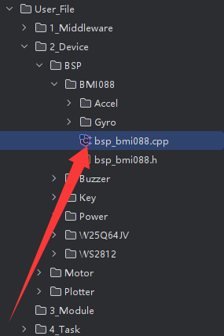
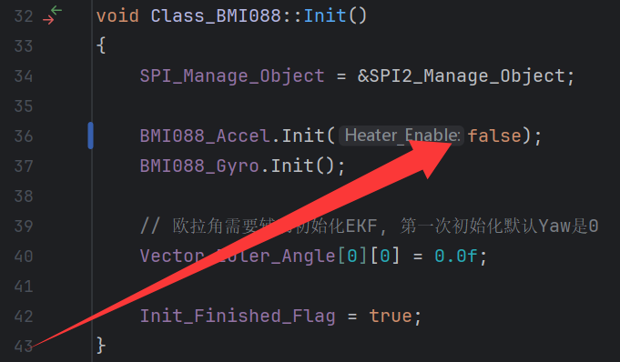

# 达妙-MC02开发板BSP混合例程

## 1 项目概述

1. 本项目工作路径为[dm02_test](./dm02_test), 支持RM常见的数学库, 通信驱动库, 板载模块库, RM电机与达妙电机库等, 并实现了测试例程, 位于[tsk_config_and_callback.cpp](./dm02_test/User_File/4_Task/tsk_config_and_callback.cpp)中

   项目演示教学视频: (后续更新)

   教学视频合集: https://space.bilibili.com/337732684/lists/1043942

   由于达妙板温控直接接入了24V, 为保证安全, 此代码默认关闭IMU的温控. 当初次烧写代码并确认IMU工作正常, 即Vofa+的位姿信息正常时, 可使能IMU的加热电阻. 使能加热电阻的方式如下

   > 打开如下图所示的文件[bsp_bmi088.cpp](./dm02_test/User_File/2_Device/BSP/BMI088/bsp_bmi088.cpp)
   >
   > 
   >
   > 将代码 " BMI088_Accel.Init(false); " 的 " false " 修改为 " true " 即可
   >
   > 

2. 为便于各位开发者直接上手工程自行编写代码, 本项目还有一个空工程用于参考, 位于[dm02_test_pure](./dm02_test_pure)
3. 此外, 本项目还有一个基于BMI088陀螺仪的小项目, 位于[dm02_mouse_test](./dm02_mouse_test), 烧录该程序, 利用USB-Type-C数据线将开发板接入电脑后可实现陀螺仪感应鼠标的功能

## 2 开发环境

开发环境配置视频: https://www.bilibili.com/video/BV1Rx4y1C7d4

每个软件均可尝试最新版本先行构建, 如若最新版本出现编译失败等问题, 则建议切换回上文环境配置参考视频中的版本测试是否为开发环境问题

- 代码生成器
  - STM32CubeMX
    - 官网下载最新版即可, https://www.st.com/en/development-tools/stm32cubemx.html
- 编辑器
  - CLion
    - 版本: 2025.2
    - https://www.jetbrains.com/clion/
- 编译工具链
  - arm-none-eabi-gcc
    - 版本: 13.3.1-20240614
    - https://developer.arm.com/downloads/-/arm-gnu-toolchain-downloads
  - MinGW
    - 版本: 12.0-w64
    - https://github.com/niXman/mingw-builds-binaries
  - CMake
    - 无需额外安装, 使用CLion内部集成的即可
  - ninja
    - 无需额外安装, 使用CLion内部集成的即可
- 烧录器
  - OpenOCD
    - 版本: 20231002-0.12.0
    - https://sourceforge.net/projects/openocd/files/
    - DAPLink配置文件位置: [daplink.cfg](./dm02_test/User_Config/daplink.cfg)
    - STLink配置文件位置: [stlink.cfg](./dm02_test/User_Config/stlink.cfg)
- 绘图调试工具
  - 当前示例程序默认的绘图调试工具为Vofa+, 由USB虚拟串口引出. 后续可按需修改为Serialplot, 亦可按需修改为UART串口
  - Vofa+
    - https://www.vofa.plus/
  - Serialplot
    - https://serialplot.ozderya.net/downloads/serialplot-0.12.0-win32-setup.exe

## 3 达妙板相关文档

达妙板官方仓库: https://gitee.com/kit-miao/dm-mc02

亦可查阅我整理的目录: [ref](./ref)